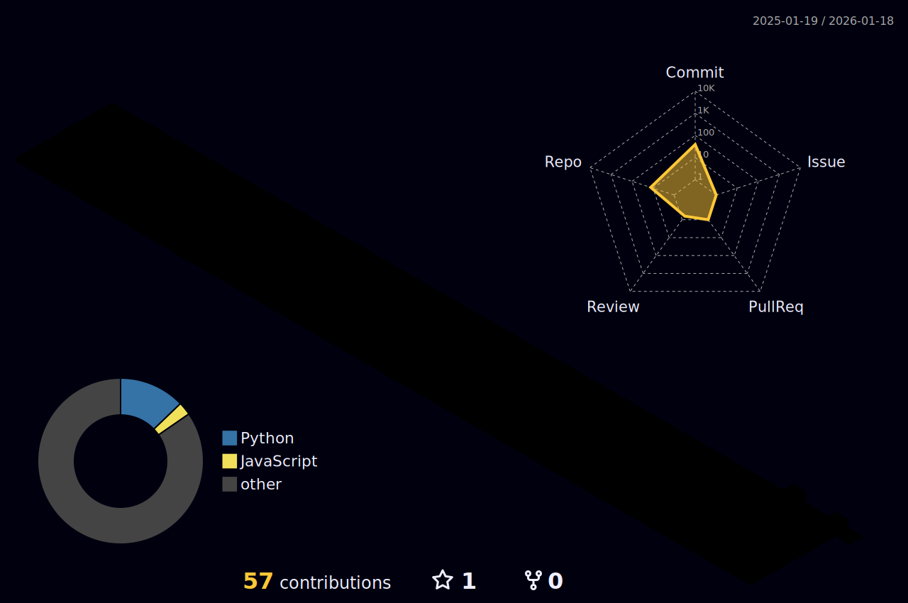

<div align="center">


<br><br>

<picture>
  <source media="(prefers-color-scheme: dark)" srcset="./profile-3d-contrib/profile-night-rainbow.svg" />
  <source media="(prefers-color-scheme: light)" srcset="./profile-3d-contrib/profile-green-animate.svg" />
  
</picture>

<br><br>

```js
const DEADMAN = {
    philosophy: "If it costs money, I build a free alternative",
    mission: "Open source everything. Simplify complexity.",
    stack: ["Python", "TypeScript", "Lua", "Rust", "Go"],
    ai: ["Claude", "OpenAI", "Gemini", "PyTorch", "CUDA"],
    infra: ["Docker", "Kubernetes", "AWS", "Cloudflare"],
    current: "Building free alternatives to $500+/month services"
};
```

<br>

---

<br>

<a href="https://github.com/DeadManOfficial/token-optimization"></a>
<a href="https://github.com/DeadManOfficial/DeadManIntelligenceCommand"></a>
<a href="https://github.com/DeadManOfficial/DeadManAI_Framework_TheUnseen"></a>

<a href="https://github.com/DeadManOfficial/claude-canvas"></a>
<a href="https://github.com/DeadManOfficial/costco-warehouse-intelligence"></a>
<a href="https://github.com/DeadManOfficial/intel-mission-control"></a>

<br><br>

---

<br>

<a href="https://open.spotify.com/user/3133qm4wimam7vxe3kttlljjcld4">
  
</a>

<br><br>

---

<br>


<br>

<a href="https://github.com/DeadManOfficial"></a>
<a href="https://twitter.com/DeadManAI"></a>

</div>
